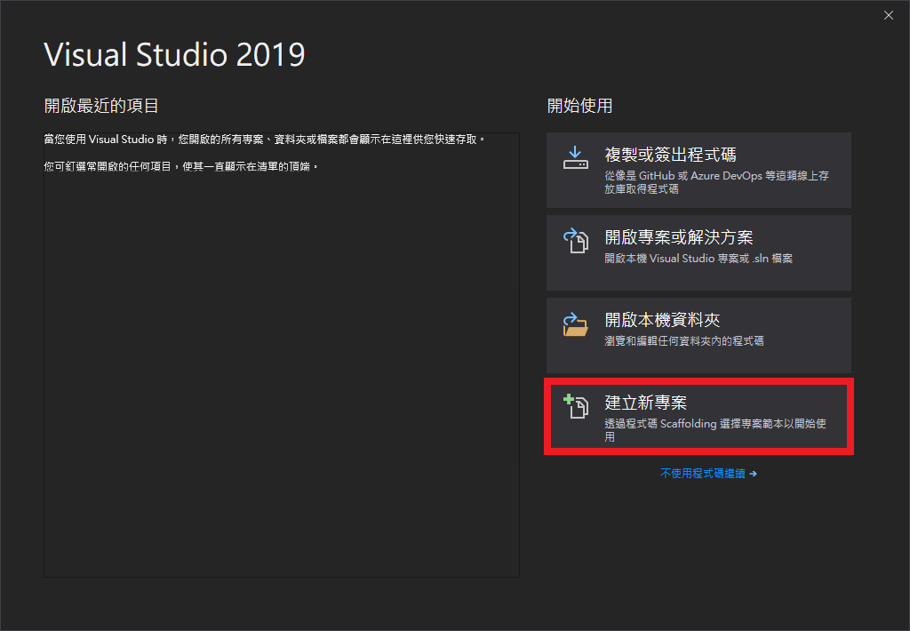
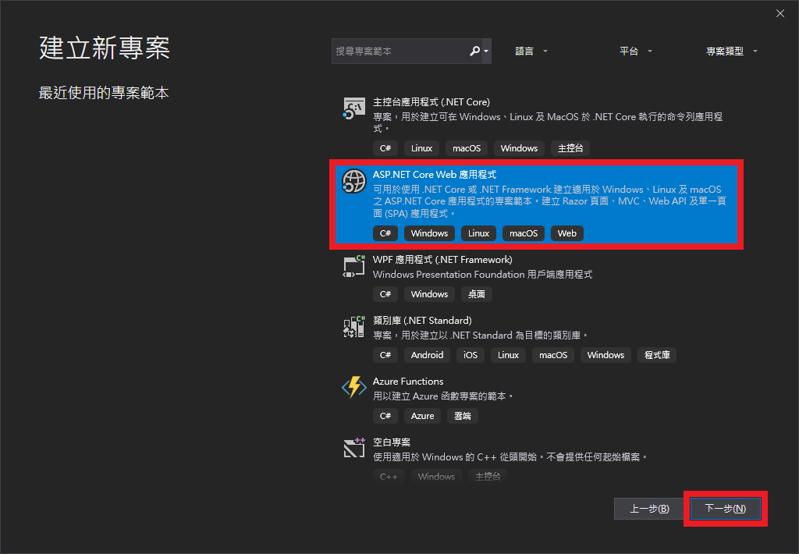
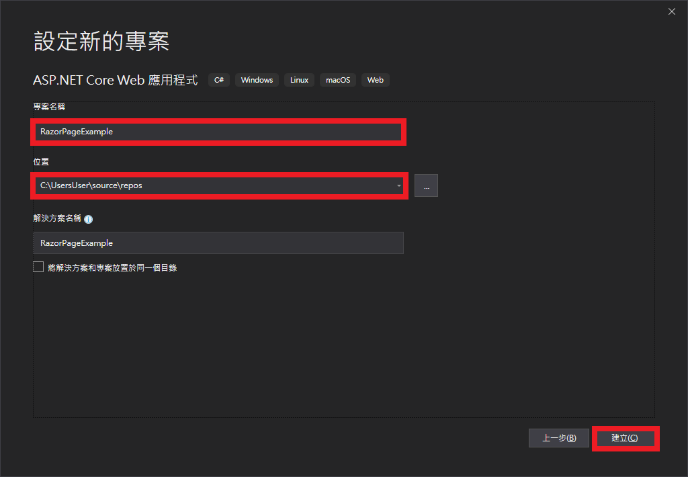
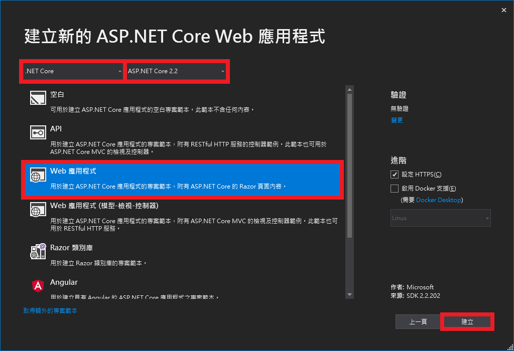

# RazorPageExample

## 如何建立預設專案?
1. 打開 **Visual Studio 2019**，再點按**建立新專案**按鈕。

2. 選擇 **ASP.NET Core Web 應用程式**，再點按**下一步**按鈕。

3. 輸入**專案名稱**並選擇專案**存放位置**，再點按**建立**按鈕。

4. 選擇使用 **.NET Core** 及 **ASP.NET Core 2.2**，並選擇 **Web 應用程式**範本，再點按**建立**按鈕。

